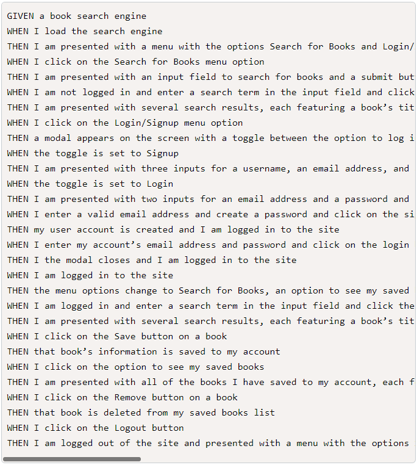

# Book Search Engine Starter Code
test
## Description
Application uses Apollo Server and Graphql to provide the user the ability to sign up, login, search for books and save books. 

## Link to GitHub repo
[Github Repo](https://github.com/catse2000/book-search)

## Link to Application
[Deployed App](https://mysterious-forest-53925.herokuapp.com/)

## Screenshot

## User Story

## Acceptance Criteria
