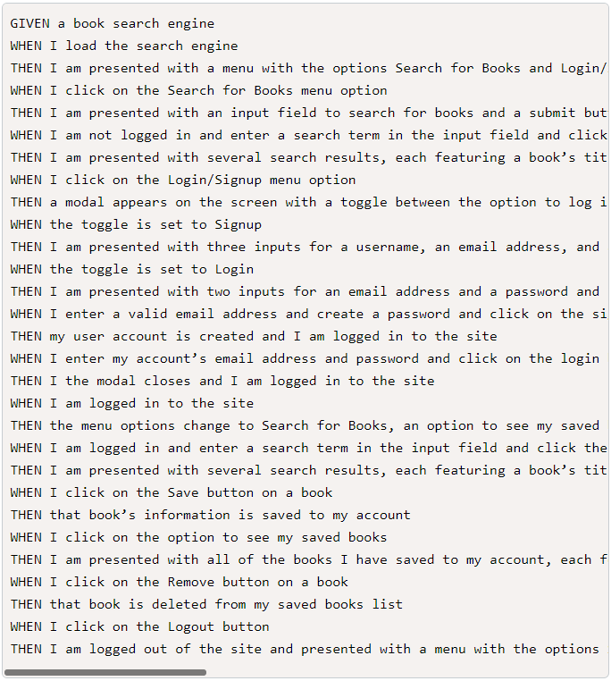

# Book Search Engine Starter Code

## Description
Application uses Apollo Server and Graphql to provide the user the ability to sign up, login, search for books and save books. 

## Link to GitHub repo
[Github Repo]()

## Link to Application
[Deployed App](https://powerful-savannah-82469.herokuapp.com/)

## Screenshot

## User Story

## Acceptance Criteria
